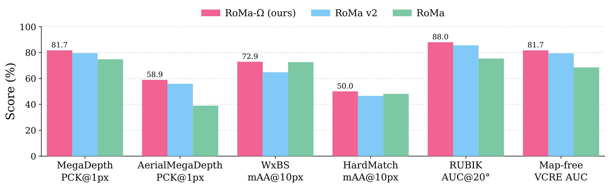

<div align="center">
<h1>RoMa-Ω: What Feed-Forward 3D Models Know About Image Matching</h1>


<a href="https://arxiv.org/abs/TBD"></a>

**Chalmers University of Technology**; **Linköping University**; **University of Amsterdam**; **Lund University**

[David Nordström*](https://scholar.google.com/citations?user=-vJPE04AAAAJ), [Johan Edstedt*](https://scholar.google.com/citations?user=Ul-vMR0AAAAJ&hl),  [Xinyue Zhang](https://scholar.google.fi/citations?user=WvixLxcAAAAJ), [Thibaut Loiseau](https://scholar.google.com/citations?user=qDSlhTUAAAAJ), [Vincent Lepetit](https://scholar.google.com/citations?user=h0a5q3QAAAAJ), [Fredrik Kahl](https://scholar.google.com/citations?user=P_w6UgMAAAAJ)
</div>

<p align="center">
    
    <br>
    <em>We replace the DINOv3 backbone of RoMa v2 with features from the VGGT-Ω architecture. This small change leads to our model, RoMa-Ω, which achieves state-of-the-art performance on a wide range of benchmarks, surpassing the current best matchers RoMa and RoMa v2. In particular, \ours~surpasses RoMa on the difficult matching benchmarks WxBS and HardMatch, which RoMa v2 did not.</em>
</p>

## Overview
RoMa-Ω is a powerful but slow dense matcher that builds on [RoMa v2](https://github.com/Parskatt/RoMaV2). We change the DINOv3 backbone in RoMa v2 for VGGT-Ω and retrain. The resulting model is slightly stronger than RoMa v2 on most benchmarks and quite a bit stronger on difficult matching (like HardMatch and WxBS). As part of our paper, we also explore the zero-shot matching abilities of VGGT-Ω, which we release code for in this repo.

## Updates
- [August 6, 2026] Initial public release of the code.

## Setup/Install
In your python environment (tested on Linux python 3.12), run:
```bash
uv sync
```

## License
All our code is MIT license.

## Acknowledgement
Code is based on [RoMaV2](https://github.com/Parskatt/RoMaV2) by [Parskatt](https://github.com/Parskatt).

## BibTeX
If you find our models useful, please consider citing our papers!
```bibtex
@inproceedings{nordstrom2026romaomega,
      title={RoMa-$\Omega$: What Feed-Forward 3D Models Know About Image Matching}, 
      author={David Nordström and Xinyue Zhang and Thibaut Loiseau and Vincent Lepetit and Fredrik Kahl},
      booktitle={Proceedings of the European Conference on Computer Vision (ECCV) Workshops},
      year={2026}
}

```
